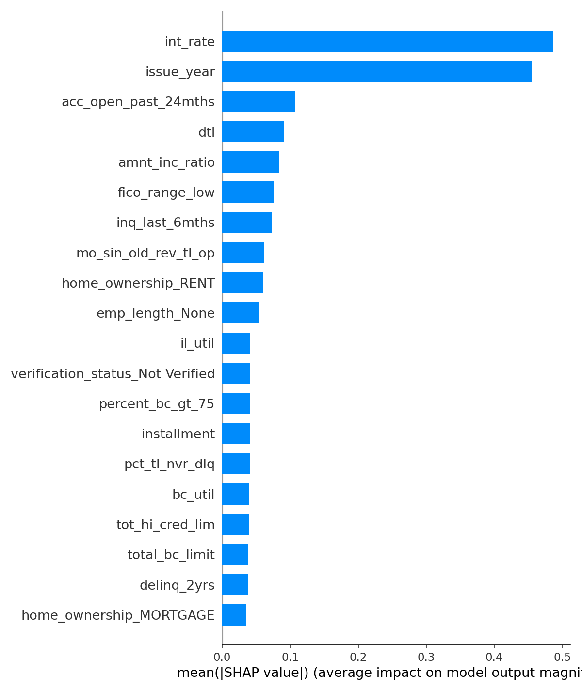
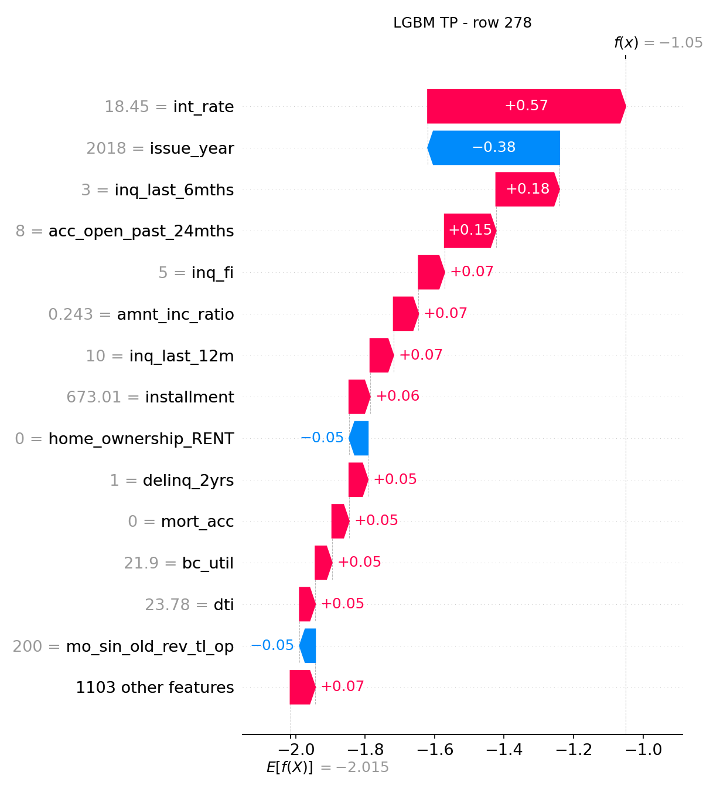

# Model Card v1 – Banksafe Credit-Risk

* LGBM model: v1.0 (trained 2025-07-22, seed=42)

## Model Details
| Item | LightGBM | Logistic Regression |
|------|----------|---------------------|
| Algorithm | Gradient Boosting (LightGBM 4.x) | Scikit-learn LogisticRegression |
| Training data | LendingClub loans ≤ 2017, stratified temporal split; 2018 held out for evaluation. | Same |
| Features | 1 117 (numeric + OHE) | Same |

A total of 70 columns were dropped prior to training due to data leakage risk (e.g., post-origination payments, delinquency, and hardship status fields).

Features include borrower credit profiles, loan metadata, income and debt ratios, and one-hot encoded categorical variables.

## Intended Use
* Early-stage loan risk screening  
* Not a sole decision-maker; must be reviewed by human underwriter

## Evaluation Metrics
| Metric (hold-out 2018) | LightGBM | Logistic Reg |
|------------------------|----------|--------------|
| AUC | 0.73 | 0.59 |
| F-2 at θ = 0.15 | 0.166 | 0.105 |

## Threshold Rationale
* Threshold 0.15 maximises F-2 (β = 2) on validation.  
* Captures ≈ 40 % of defaulters at ~5 % precision.

## Explainability
**Global feature importance based on mean absolute SHAP values.**

The top contributors to the model's predictions are `int_rate`, `issue_year`, and `acc_open_past_24mths`, indicating that interest rates and loan issuance timing are the strongest global drivers of default risk.

**Breakdown of the individual prediction for a true positive case.**

In this example, `int_rate` had the largest positive influence pushing the model toward default prediction, while `issue_year` reduced the risk. This visualization helps explain how specific features led to the model's output for a particular borrower.

## Ethical Considerations & Fairness
* TBD in Step 6 (fairness metrics)

## Caveats & Recommendations
* Intended users: risk analysts, loan underwriters
* Deployment: backend pipeline / batch scoring
* Low precision → high false-positive ops cost  
